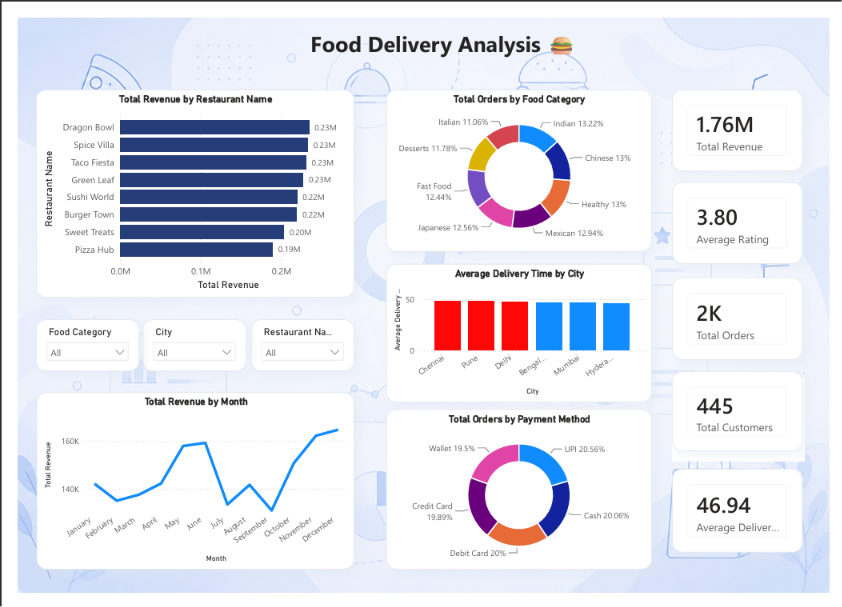

# 🍔 Food Delivery Analysis Dashboard

## 📖 Project Overview

This project presents an interactive Power BI dashboard for analyzing food delivery operations. It provides insights into revenue, customer behavior, food category preferences, restaurant performance, delivery efficiency, and payment methods to support business decision-making.

---

## 🛠️ Tech Stack

- Power BI Desktop
- Power Query
- DAX
- Microsoft Excel

---

## 📂 Repository Structure

```text
Dashboard/
Dataset/
Images/
README.md
```

---

## 📊 Dashboard Preview

### Food Delivery Dashboard



---

## 📈 Key Performance Indicators (KPIs)

- 💰 Total Revenue: **1.76M**
- ⭐ Average Rating: **3.80**
- 🛒 Total Orders: **2K**
- 👥 Total Customers: **445**
- 🚚 Average Delivery Time: **46.94 Minutes**

---

## 📊 Dashboard Features

- Revenue Analysis by Restaurant
- Food Category Distribution
- Monthly Revenue Trend
- Payment Method Analysis
- Average Delivery Time by City
- Interactive Filters (Category, City, Restaurant)
- KPI Summary Cards

---

## 📈 Business Insights

- Dragon Bowl generated the highest revenue among all restaurants.
- UPI was the most preferred payment method.
- Chinese and Healthy food categories contributed significantly to total orders.
- Revenue showed a noticeable increase toward the end of the year.
- Average delivery time remained close to **47 minutes** across major cities.
- The dashboard enables interactive analysis using category, city, and restaurant filters.

---

## 🎯 Skills Demonstrated

- Data Cleaning using Power Query
- Data Modeling
- DAX Measures
- KPI Design
- Interactive Dashboard Design
- Business Intelligence Reporting
- Data Visualization

---

## 👨‍💻 Author

**Kuldeep Ghura**
